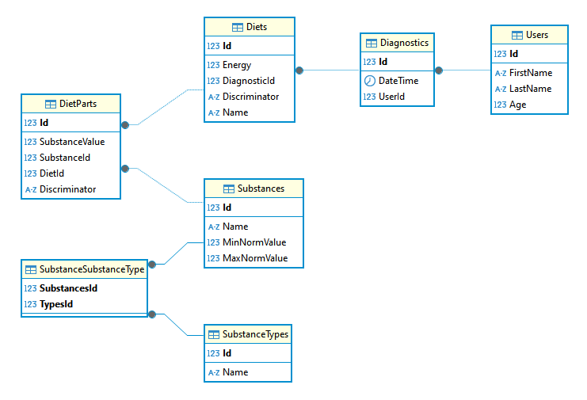

# Biocom
## Тестовое задание

Результаты диагностики хранятся в табл. Диагностика (Diagnostics).Диагностика включает в себя  различные типы питания (табл. Diets). В данной задаче питание бывает 3 типов: питание (табл. Diets), здоровое питание (табл. HealthyDiets)  и Бады (табл. Supplement). HealthyDiets и Supplement наследники Diets - в бд являются одной таблицей. Каждое питание предствляет из себя набор микроэлементов, витаминов, др. полезных веществ (табл. DietParts) и калорийность. Питательные вещества имеют допустимые значения и представлены табл. Substance.

В задаче реализовано добавление диагностики. Новые питательные вещества и БАДы автоматически добавляются в БД, существующие не обновляются.
Получение диагностики осуществляется по userId; получаемый результат является последним добавленным.